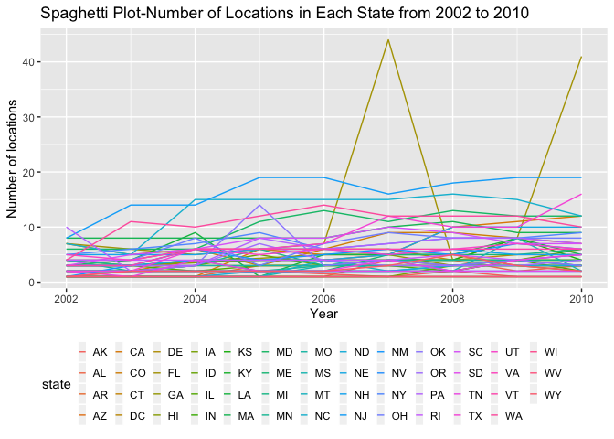
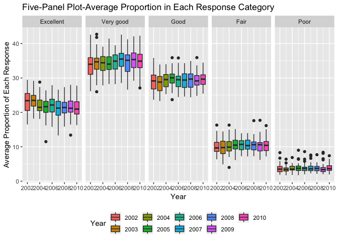
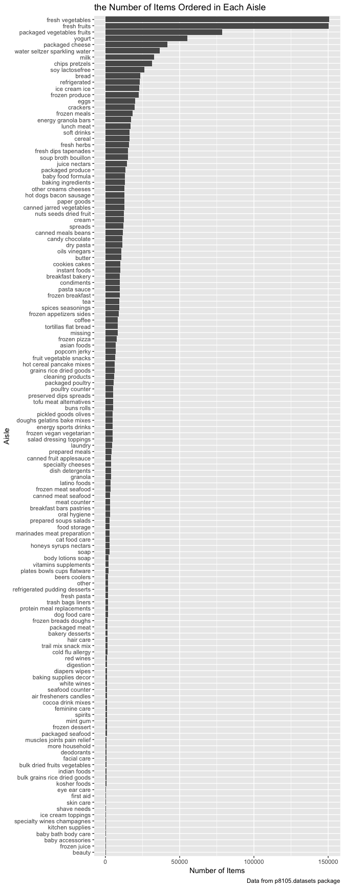
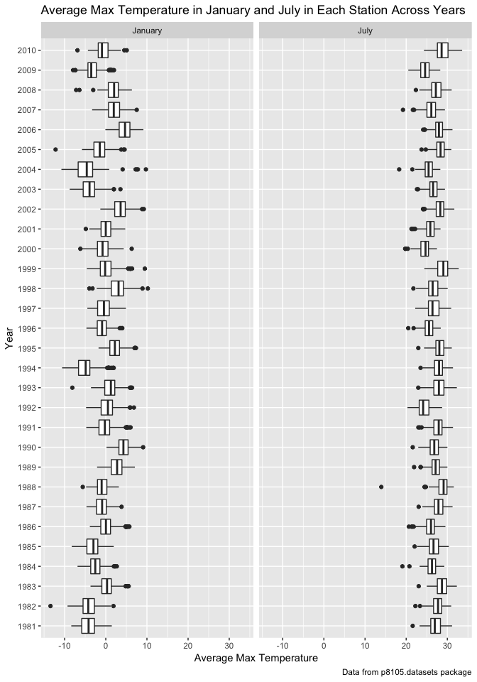
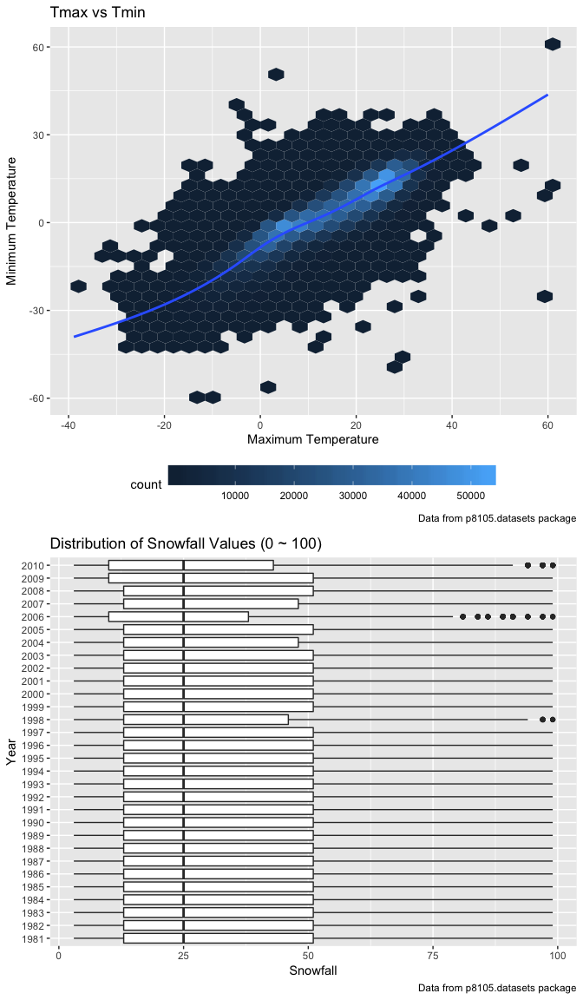

p8105\_hw3\_zw2541
================
Zixu\_Wang
10/5/2018

Problem 1
---------

#### Read and clean the data

``` r
library(p8105.datasets)

data("brfss_smart2010")

brfss = brfss_smart2010 %>% 
  janitor::clean_names() %>% 
  rename(state = locationabbr, county = locationdesc) %>% 
  filter(topic == "Overall Health") %>% 
  filter(response %in% c("Excellent", "Very good","Good", "Fair", "Poor")) %>% 
  mutate(response = factor(response, levels = c("Excellent", "Very good","Good", "Fair", "Poor")))
```

#### Using this dataset, do or answer the following:

-   In 2002, which states were observed at 7 locations?

``` r
brfss %>% 
  filter(year == "2002") %>% 
  group_by(state) %>% 
  summarize(n_location = n_distinct(county)) %>% 
  filter(n_location == "7")
```

    ## # A tibble: 3 x 2
    ##   state n_location
    ##   <chr>      <int>
    ## 1 CT             7
    ## 2 FL             7
    ## 3 NC             7

In 2002, Connecticut, Florida, and North Carolina were observed at 7 locations.

-   Make a “spaghetti plot” that shows the number of locations in each state from 2002 to 2010.

``` r
brfss %>% 
  group_by(state,year) %>% 
  summarize(n_locations = n_distinct(county)) %>% 
  ggplot(aes(x = year, y = n_locations, color = state)) +
  geom_line() +
  labs(
        title = "Spaghetti Plot-Number of Locations in Each State from 2002 to 2010",
        y = "Number of locations",
        x = "Year",
        caption = "Data from p8105.datasets package") +
  theme(legend.position = "bottom",
        legend.key.width = unit(.25, 'cm')) +
  guides(color = guide_legend(ncol = 15))
```



The figure above shows the number of locations being observed in each state from 2002 to 2010. For most states, number of locations approximately keep the same during these eight years and always below 20 locations. However, the number of locations in Florida changed dramaticly from 2006 to 2008.

-   Make a table showing, for the years 2002, 2006, and 2010, the mean and standard deviation of the proportion of "Excellent" responses across locations in NY State.

``` r
brfss %>% 
  group_by(state, year) %>% 
  filter(year %in% c("2002", "2006", "2010"),
         state == "NY",
         response == "Excellent") %>% 
  summarize(mean_prop = mean(data_value),
            sd_prop = sd(data_value)) %>% 
  knitr::kable(digits = 3)
```

| state |  year|  mean\_prop|  sd\_prop|
|:------|-----:|-----------:|---------:|
| NY    |  2002|      24.040|     4.486|
| NY    |  2006|      22.533|     4.001|
| NY    |  2010|      22.700|     3.567|

The mean and sd of the proportion of "Excellent" are approximately the same in 2002, 2006 and 2010.

-   For each year and state, compute the average proportion in each response category (taking the average across locations in a state). Make a five-panel plot that shows, for each response category separately, the distribution of these state-level averages over time.

``` r
brfss %>% 
  group_by(year, state, response) %>% 
  summarize(response_average = mean(data_value, na.rm = TRUE)) %>% 
  ggplot(aes(x = year, y = response_average)) +
  geom_boxplot(aes(fill = factor(year))) +
  facet_grid(.~response) +
  labs(
        title = "Five-Panel Plot-Average Proportion in Each Response Category",
        y = "Average Proportion of Each Response",
        x = "Year",
        caption = "Data from p8105.datasets package") +
  theme(legend.position = "bottom") +
  scale_fill_discrete(name = "Year")
```



First, we could conclude from the figures above that the mean of each response remained constent from 2002 to 2010. Second, the "Very good" response has the highest mean among this response category and the "Poor" response has the lowest. Third, the mean increases from "Poor" to "Very good", and decreases when it comes to "Excellent".

Problem 2
---------

#### Read and clean the data

``` r
data(instacart)
instacart = janitor::clean_names(instacart)
skimr::skim(instacart)
```

    ## Skim summary statistics
    ##  n obs: 1384617 
    ##  n variables: 15 
    ## 
    ## ── Variable type:character ───────────────────────────────────────────────────────────
    ##      variable missing complete       n min max empty n_unique
    ##         aisle       0  1384617 1384617   3  29     0      134
    ##    department       0  1384617 1384617   4  15     0       21
    ##      eval_set       0  1384617 1384617   5   5     0        1
    ##  product_name       0  1384617 1384617   3 159     0    39123
    ## 
    ## ── Variable type:integer ─────────────────────────────────────────────────────────────
    ##                variable missing complete       n       mean        sd p0
    ##       add_to_cart_order       0  1384617 1384617       8.76      7.42  1
    ##                aisle_id       0  1384617 1384617      71.3      38.1   1
    ##  days_since_prior_order       0  1384617 1384617      17.07     10.43  0
    ##           department_id       0  1384617 1384617       9.84      6.29  1
    ##               order_dow       0  1384617 1384617       2.7       2.17  0
    ##       order_hour_of_day       0  1384617 1384617      13.58      4.24  0
    ##                order_id       0  1384617 1384617 1706297.62 989732.65  1
    ##            order_number       0  1384617 1384617      17.09     16.61  4
    ##              product_id       0  1384617 1384617   25556.24  14121.27  1
    ##               reordered       0  1384617 1384617       0.6       0.49  0
    ##                 user_id       0  1384617 1384617   1e+05     59487.15  1
    ##     p25     p50     p75    p100     hist
    ##       3       7      12      80 ▇▃▁▁▁▁▁▁
    ##      31      83     107     134 ▃▇▃▃▇▅▅▆
    ##       7      15      30      30 ▂▅▃▃▁▂▁▇
    ##       4       8      16      21 ▃▇▂▁▂▆▁▃
    ##       1       3       5       6 ▇▅▃▃▁▃▅▅
    ##      10      14      17      23 ▁▁▃▇▇▇▅▂
    ##  843370 1701880 2568023 3421070 ▇▇▇▇▇▇▇▇
    ##       6      11      21     100 ▇▂▁▁▁▁▁▁
    ##   13380   25298   37940   49688 ▆▆▇▇▇▆▇▇
    ##       0       1       1       1 ▆▁▁▁▁▁▁▇
    ##   51732   1e+05  154959  206209 ▇▇▇▇▇▇▇▇

This "instacart" dataset documents the shoppoing history of different client. From the table above, we know that there are total 1384617 observations and 15 variables. Among these 15 variables, 4 are character variables ("aisle", "department", "eval\_set", "product\_name"), and others are all numeric variables. The meaning of each variables are showing below:

-   order\_id: the id number of each order
-   product\_id: the id number of each product
-   add\_to\_cart\_order: the order of each product be added to the cart by a client
-   reordered: whether this product has been ordered before (1 means TRUE, 0 means FALSE)
-   user\_id: the id number of the user
-   eval\_set: evaluation set
-   order\_number: the time of this order among the shopping history
-   order\_dow: the day in a week when the order has been placed(0 means Sunday, 1 means Monday and 6 means Saturday)
-   order\_hour\_of\_day: the time in a day when the order has been placed
-   days\_since\_prior\_order: the days between this order and the client's previous order
-   product\_name: the name of the product
-   aisle\_id: the id number of aisle
-   department\_id: the id number of department
-   aisle: the name of the aisle the product belongs to
-   department: the name of the department

For example, user(112108) placed an order(order\_id: 1) of eight products(Bulgarian Yogurt, Organic 4% Milk Fat Whole Milk Cottage Cheese, etc) at 10am on Thursday. And the order is this user's fourth order.

#### Using this dataset, do or answer the following:

-   How many aisles are there, and which aisles are the most items ordered from?

``` r
n_distinct(instacart$aisle)
```

    ## [1] 134

``` r
instacart %>% 
  group_by(aisle) %>% 
  summarize(n_aisle = n()) %>% 
  arrange(desc(n_aisle))
```

    ## # A tibble: 134 x 2
    ##    aisle                         n_aisle
    ##    <chr>                           <int>
    ##  1 fresh vegetables               150609
    ##  2 fresh fruits                   150473
    ##  3 packaged vegetables fruits      78493
    ##  4 yogurt                          55240
    ##  5 packaged cheese                 41699
    ##  6 water seltzer sparkling water   36617
    ##  7 milk                            32644
    ##  8 chips pretzels                  31269
    ##  9 soy lactosefree                 26240
    ## 10 bread                           23635
    ## # ... with 124 more rows

There are 134 distinct aisles, and "fresh vegetables" aisle is the most items ordered from.

-   Make a plot that shows the number of items ordered in each aisle.

``` r
  instacart %>% 
  group_by(aisle) %>% 
  summarize(n_aisle = n()) %>% 
  arrange(desc(n_aisle)) %>% 
  mutate(aisle = forcats::fct_reorder(aisle, n_aisle, .desc = FALSE)) %>% 
  ggplot(aes(x = aisle, y = n_aisle)) +
  geom_bar(stat = "identity") +
  coord_flip() +
  labs(
    title = "the Number of Items Ordered in Each Aisle",
    x = "Aisle",
    y = "Number of Items",
    caption = "Data from p8105.datasets package") 
```



Form the figure above, we know that the number of items in "fresh vegetables" and "fresh fruits" are much higher then any other asiles, and approximately most of the asiles about daily diet (like vegetables, fruits and drinks) is higher than others. This situation illustrates that people tend to buy daily food here. \* Make a table showing the most popular item in each of the aisles "baking ingredients", "dog food care", and "packaged vegetables fruits".

``` r
instacart %>% 
  group_by(product_name, aisle) %>% 
  filter(aisle %in% c("baking ingredients", "dog food care", "packaged vegetables fruits")) %>% 
  summarize(n_items = n()) %>% 
  group_by(aisle) %>% 
  filter(n_items == max(n_items)) %>% 
  knitr::kable()
```

| product\_name                                 | aisle                      |  n\_items|
|:----------------------------------------------|:---------------------------|---------:|
| Light Brown Sugar                             | baking ingredients         |       499|
| Organic Baby Spinach                          | packaged vegetables fruits |      9784|
| Snack Sticks Chicken & Rice Recipe Dog Treats | dog food care              |        30|

The most popular item in aisle "baking ingredients" is "Light Brown Sugar", the most popular item in aisle "dog food care" is "Snack Sticks Chicken & Rice Recipe Dog Treats", and the most popular item in aisle "packaged vegetables fruits" is "Organic Baby Spinach".

-   Make a table showing the mean hour of the day at which Pink Lady Apples and Coffee Ice Cream are ordered on each day of the week; format this table for human readers (i.e. produce a 2 x 7 table).

``` r
instacart$order_dow = recode(instacart$order_dow, "0" = "Sunday", "6" = "Saturday", "5" = "Friday", "4" = "Thursday", "3" = "Wednesday", "2" = "Tuesday", "1" = "Monday") %>% 
  factor(levels = c("Monday", "Tuesday", "Wednesday", "Thursday", "Friday", "Saturday", "Sunday"))
instacart %>% 
  group_by(product_name, order_dow) %>% 
  filter(product_name %in% c("Pink Lady Apples", "Coffee Ice Cream")) %>% 
  summarize(mean_hour = mean(order_hour_of_day)) %>% 
  spread(key = order_dow, value = mean_hour) %>% 
  knitr::kable()
```

| product\_name    |    Monday|   Tuesday|  Wednesday|  Thursday|    Friday|  Saturday|    Sunday|
|:-----------------|---------:|---------:|----------:|---------:|---------:|---------:|---------:|
| Coffee Ice Cream |  14.31579|  15.38095|   15.31818|  15.21739|  12.26316|  13.83333|  13.77419|
| Pink Lady Apples |  11.36000|  11.70213|   14.25000|  11.55172|  12.78431|  11.93750|  13.44118|

People tends to buy Coffee Ice Cream around 1pm to 3pm, but on Friday people may buy the cream a little bit earlier, around 12:00 at noon. And people usually buy Pink Lady Apples around noon from 11am to 2pm.

Problem 3
---------

#### Read and clean the data

``` r
data(ny_noaa)
ny_noaa = janitor::clean_names(ny_noaa)
skimr::skim(ny_noaa)
```

    ## Skim summary statistics
    ##  n obs: 2595176 
    ##  n variables: 7 
    ## 
    ## ── Variable type:character ───────────────────────────────────────────────────────────
    ##  variable missing complete       n min max empty n_unique
    ##        id       0  2595176 2595176  11  11     0      747
    ##      tmax 1134358  1460818 2595176   1   4     0      532
    ##      tmin 1134420  1460756 2595176   1   4     0      548
    ## 
    ## ── Variable type:Date ────────────────────────────────────────────────────────────────
    ##  variable missing complete       n        min        max     median
    ##      date       0  2595176 2595176 1981-01-01 2010-12-31 1997-01-21
    ##  n_unique
    ##     10957
    ## 
    ## ── Variable type:integer ─────────────────────────────────────────────────────────────
    ##  variable missing complete       n  mean     sd  p0 p25 p50 p75  p100
    ##      prcp  145838  2449338 2595176 29.82  78.18   0   0   0  23 22860
    ##      snow  381221  2213955 2595176  4.99  27.22 -13   0   0   0 10160
    ##      snwd  591786  2003390 2595176 37.31 113.54   0   0   0   0  9195
    ##      hist
    ##  ▇▁▁▁▁▁▁▁
    ##  ▇▁▁▁▁▁▁▁
    ##  ▇▁▁▁▁▁▁▁

This "ny\_noaa" dataset documents the everyday weather information from different weather station from 1.1.1981 to 12.31.2010. From the table above, we know that there are total 2595176 observations and 7 variables. The "id" variable is a characteric variable, and it represents the id number of each weather station. The "data" variable is a data variable. "prcp", "snow" and "snwd" are all numeric variables, and they indicates the precipitation, snow and snowdepth. "tmax" and "tmin" are characteric variables, they represent the maximum and minimum temperature. However, this dataset contains a lots of missing data. The "prcp" contains 145838 missing data and "snow" contains 381221 missing data. The are 591786 missing data in "snwd" variable. And there are also more than one million missing data in the "tmax" and "tmin" variables.

#### Using this dataset, do or answer the following:

-   Do some data cleaning. Create separate variables for year, month, and day. Ensure observations for temperature, precipitation, and snowfall are given in reasonable units. For snowfall, what are the most commonly observed values? Why?

``` r
ny_noaa_tidy = 
  ny_noaa %>% 
  separate(date, c("year", "month", "day"), sep = "-") %>% 
  mutate(prcp = prcp / 10,
         tmax = as.numeric(tmax) / 10,
         tmin = as.numeric(tmin) / 10)
```

The original data interpreted "tmax" and "tmin" in tenths of degrees celsius and precipitation, snowfall and snow-depth in tenths of mm. Now we changed them into the reasonable units.

``` r
ny_noaa_tidy %>% 
  filter(!is.na(snow)) %>% 
  group_by(snow) %>% 
  summarize(n = n()) %>% 
  arrange(desc(n))
```

    ## # A tibble: 281 x 2
    ##     snow       n
    ##    <int>   <int>
    ##  1     0 2008508
    ##  2    25   31022
    ##  3    13   23095
    ##  4    51   18274
    ##  5    76   10173
    ##  6     8    9962
    ##  7     5    9748
    ##  8    38    9197
    ##  9     3    8790
    ## 10   102    6552
    ## # ... with 271 more rows

"0" is the most commonly observed value for snowfall, since snowfall is not a frequently occured weather phenomena.

-   Make a two-panel plot showing the average max temperature in January and in July in each station across years. Is there any observable / interpretable structure? Any outliers?

``` r
ny_noaa_tidy %>% 
  filter(month %in% c("01", "07")) %>% 
  mutate(month = recode(month, "01" = "January", "07" = "July")) %>% 
  group_by(id, year, month) %>% 
  summarize(mean_tmax = mean(tmax, na.rm = T)) %>% 
  ggplot(aes(x = year, y = mean_tmax)) +
  geom_boxplot() +
  facet_grid(~ month) +
  coord_flip() +
  labs(
    title = "Average Max Temperature in January and July in Each Station Across Years",
    x = "Year",
    y = "Average Max Temperature",
    caption = "Data from p8105.datasets package")
```

    ## Warning: Removed 5970 rows containing non-finite values (stat_boxplot).



The average maximum temperature in January is around 0 degree and the average maximum temperature in July is around 27.5 degree. However, the average maximum temperature in January is more fluctuated compared to July. And both in January and July exist some outliers. There are both higher and lower outliers in January, which means the maximum temperature in NY at that time are really fluctuated among different weather station. And in July, there only exist some lower outliers, which implies that in some areas in NY, the weather can be much lower compared to other areas.

-   Make a two-panel plot showing (i) tmax vs tmin for the full dataset (note that a scatterplot may not be the best option); and (ii) make a plot showing the distribution of snowfall values greater than 0 and less than 100 separately by year.

``` r
tmax_tmin = 
  ny_noaa_tidy %>% 
  ggplot(aes(x = tmax, y = tmin)) +
  geom_hex() +
  labs(
    title = "Tmax vs Tmin",
    x = "Maximum Temperature",
    y = "Minimum Temperature",
    caption = "Data from p8105.datasets package") +
  theme(legend.position = "bottom",
        legend.key.width = unit(2, "cm"))

distribution_snow =
  ny_noaa_tidy %>% 
  filter(snow > 0 , snow < 100) %>%
  ggplot(aes(x = year, y = snow)) +
  geom_boxplot() +
  coord_flip() +
  labs(
    title = "Distribution of Snowfall Values (0 ~ 100)",
    x = "Year",
    y = "Snowfall",
    caption = "Data from p8105.datasets package")

tmax_tmin / distribution_snow
```

    ## Warning: Removed 1136276 rows containing non-finite values (stat_binhex).



The figure above indicates that there exists a linear relationship between the maximum temperature and minimum temperature. And most observations of tmax is concentrating around 0 to 30 degrees while tmin concentrating around 0 to 20 degrees.

Besides, the amount of snowfall approximately stay constantly from year to year.
